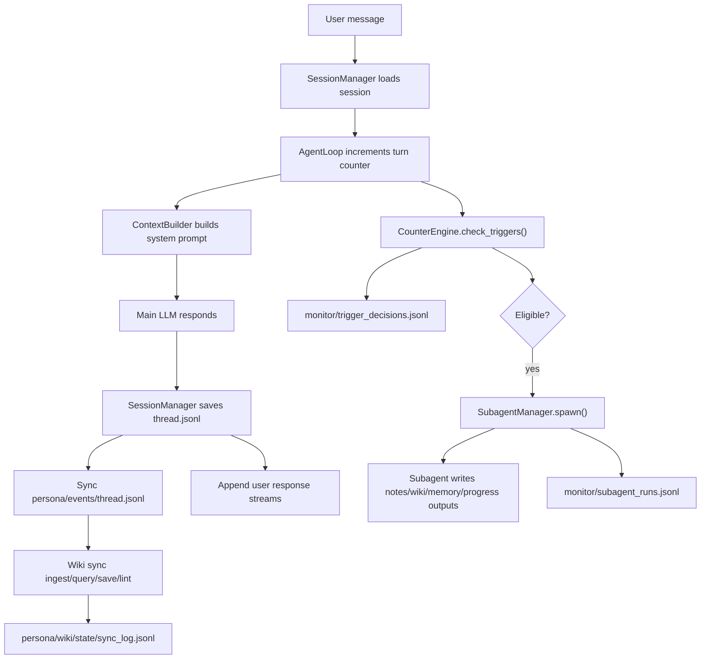
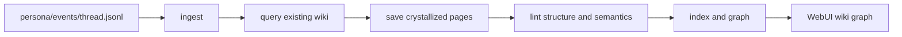

# IELTS Speaking Bot - Current Architecture

> Updated: 2026-05-31  
> Scope: current implementation, not historical prototypes.

## 1. Mental Model

The project has five runtime layers:

1. **Chat runtime**: receives user messages, builds context, calls the main LLM, streams replies, and saves session history.
2. **Trigger runtime**: checks mode-specific and global trigger definitions after user turns or cron ticks.
3. **Subagent runtime**: runs smaller background LLM jobs for vocab, polish, IELTS feedback, memory, daily consolidation, and similar tasks.
4. **Wiki runtime**: ingests new conversation events into structured wiki memory and graph data.
5. **Monitor runtime**: records observability logs for trigger decisions, subagent runs, wiki sync, token usage, and recent activity.

The canonical user-owned runtime root is `persona/`. The canonical observability root is `monitor/`.

## 2. Canonical Paths

| Data | Canonical Path | Notes |
| --- | --- | --- |
| Per-session thread | `persona/sessions/{session_uuid}/thread.jsonl` | Raw session conversation history. |
| Session metadata | `persona/sessions/{session_uuid}/metadata.json` | Includes mode, title, counters, and webui metadata. |
| Session index | `persona/session_index.jsonl` | Fast list of known sessions. |
| Global event stream | `persona/events/thread.jsonl` | Cross-session derived event stream with stable IDs. |
| User response stream | `persona/user_responses.jsonl` | User-only answers for learning/progress/wiki flows. |
| Benative articles | `persona/benative/articles/` | Source articles for Be Native practice. |
| Benative pairs | `persona/benative/pairs/` | Sentence-level English/Chinese translation pairs. |
| Benative responses | `persona/benative/sessions/{session_uuid}/responses.jsonl` | User translation attempts for review. |
| Long-term memory | `persona/memory/MEMORY.md` | User memory read by the main agent. |
| Trigger runtime state | `persona/trigger/` | Cron jobs and count/file cursor state. |
| Wiki memory | `persona/wiki/` | Raw sources, pages, indexes, graph, and sync state. |
| Subagent monitor | `monitor/subagent_runs.jsonl` | System observability log (rotated at 10 MiB, 10 backups). |
| Trigger monitor | `monitor/trigger_decisions.jsonl` | System observability log (rotated at 10 MiB, 10 backups). |

Legacy root-level `data/`, `sessions/`, `memory/`, and `trigger/` test data have been removed from the active architecture.

## 3. User Turn Flow



Important rule: only user turns should drive user-learning analysis. Assistant replies are saved to session history, but user-response extraction and most learning triggers should be based on user-authored content.

## 4. Trigger Runtime

Trigger definitions live in:

| Scope | Path |
| --- | --- |
| Default/global | `mode/default/trigger/triggers.json` |
| Freechat | `mode/freechat/trigger/triggers.json` |
| IELTS | `mode/ielts/trigger/triggers.json` |
| Benative | `mode/benative/trigger/triggers.json` |

Supported trigger kinds:

| Kind | Meaning | Cursor/State |
| --- | --- | --- |
| `turn_count` | Fire every N user turns in a session. | Session metadata key `_counter_last_trigger_{id}`. |
| `file_line_count` | Fire when a source file gains N new lines. | `persona/trigger/count/.cursor_{id}.json`. |
| `cron` | Fire from `CronService`. | `persona/trigger/cron/jobs.json` and per-job cursor files. |

Every trigger check should write a decision to `monitor/trigger_decisions.jsonl`:

- `skipped`: disabled, invalid count, wrong time, missing source, etc.
- `no_delta`: checked correctly but no new content is available.
- `eligible`: condition is met and the trigger is ready to run.
- `spawned`: subagent or processor was launched/completed.
- `failed`: prompt missing, processor error, subagent spawn error, cron error.

The WebUI monitor reads this log through `/api/admin/monitor`.

## 5. Subagent Runtime

Subagent prompts and processors are organized by role:

| Role | Path | Examples |
| --- | --- | --- |
| Single-session LLM subagents | `subagent/single_session/{name}/context/` | `vocab`, `polisher`, `ielts_feedback`, `benative_review` |
| Cross-session LLM subagents | `subagent/cross_session/{name}/context/` | `memory_cron`, `daily_consolidator` |
| Deterministic processors | `subagent/cross_session/{name}/processor/` | wiki processors, review processors |
| Shared subagent helpers | `subagent/_shared/` | base classes, registries, utilities |

`SubagentManager` records each completed run in `monitor/subagent_runs.jsonl`, including:

- task id
- label
- model
- task prompt
- result
- token usage
- tool events
- written artifact deltas
- error status

The current model target is `deepseek-v4-flash` unless a trigger or config explicitly overrides it.

## 6. Cron Runtime

Cron jobs are stored at:

```text
persona/trigger/cron/jobs.json
```

Current cron jobs are executed by `CronService`, then dispatched in `bot/nanobot/cli/commands.py`.

Cron delta handling is incremental:

- `memory_cron` uses session thread deltas and only processes sessions with new messages.
- `daily_consolidator` uses session note deltas and only processes changed vocab/polisher notes.
- Cursor state is stored under `persona/trigger/cron/`.
- No-delta runs are still logged to `monitor/trigger_decisions.jsonl`.

This means hourly or daily cron jobs should not reprocess the full historical corpus unless the cursor is deleted or reset.

## 7. Wiki Runtime

Wiki is a structured memory layer under `persona/wiki/`.

Canonical wiki page root:

```text
persona/wiki/wiki/
```

Core wiki files:

| Path | Purpose |
| --- | --- |
| `persona/wiki/raw/` | Raw source records when present. |
| `persona/wiki/wiki/` | Markdown wiki pages with frontmatter. |
| `persona/wiki/index/wiki.sqlite` | Search/query index. |
| `persona/wiki/state/` | Sync state and cursors. |
| `persona/wiki/state/sync_log.jsonl` | Wiki sync observability log. |
| `persona/wiki/log.jsonl` | Wiki operation log. |

Current wiki flow:



The wiki schema supports categories such as `source`, `entity`, `concept`, `comparison`, `question`, `synthesis`, `decision`, `gap`, and `meta`, but the WebUI graph should surface user-facing entities, topics, and relationships rather than internal schema labels.

## 8. Monitor Runtime

The admin monitor is served by:

```text
GET /api/admin/monitor
```

It aggregates:

| Data | Source |
| --- | --- |
| Trigger definitions and editable counts | `mode/*/trigger/triggers.json` |
| Prompt previews | `subagent/*/*/context/*.md` and mode context files |
| Trigger decisions | `monitor/trigger_decisions.jsonl` |
| Subagent runs | `monitor/subagent_runs.jsonl` plus legacy fallback |
| Wiki sync runs | `persona/wiki/state/sync_log.jsonl` |
| Cost estimates | token usage from subagent runs and last main turn |
| Recent activity | session thread metadata/tool events |

The monitor should answer three debugging questions quickly:

1. Did the trigger condition run, and why did it pass or skip?
2. If it passed, did a subagent or processor actually run?
3. If it ran, what did it output or write?

## 9. WebUI Runtime

Main WebUI areas:

| Area | Role |
| --- | --- |
| Chat | Primary user conversation and mode-specific practice. |
| Notes | User-authored notes and AI note replies. |
| Wiki | Structured memory graph and related pages. |
| Monitor | Operational view for prompts, triggers, subagent runs, wiki sync, and cost. |
| Settings | Provider/API settings. |

The WebUI should render runtime data incrementally. It should not be the source of truth for learning data; source of truth remains `persona/` and `monitor/`.

## 10. File Ownership Rules

- `persona/` is user/business runtime data.
- `monitor/` is system observability runtime data.
- `mode/` is source-like mode configuration.
- `subagent/` is source-like subagent and processor implementation.
- `bot/nanobot/` is application code.
- `bot/webui/` is frontend code.
- Runtime test data should not be committed.

When adding a new feature, decide its owner first:

| Question | Usually Means |
| --- | --- |
| Is it user memory or learning material? | `persona/` |
| Is it an operational trace? | `monitor/` |
| Is it static behavior config? | `mode/` |
| Is it an LLM worker instruction? | `subagent/.../context/` |
| Is it deterministic processing code? | `subagent/.../processor/` or `bot/nanobot/...` |
