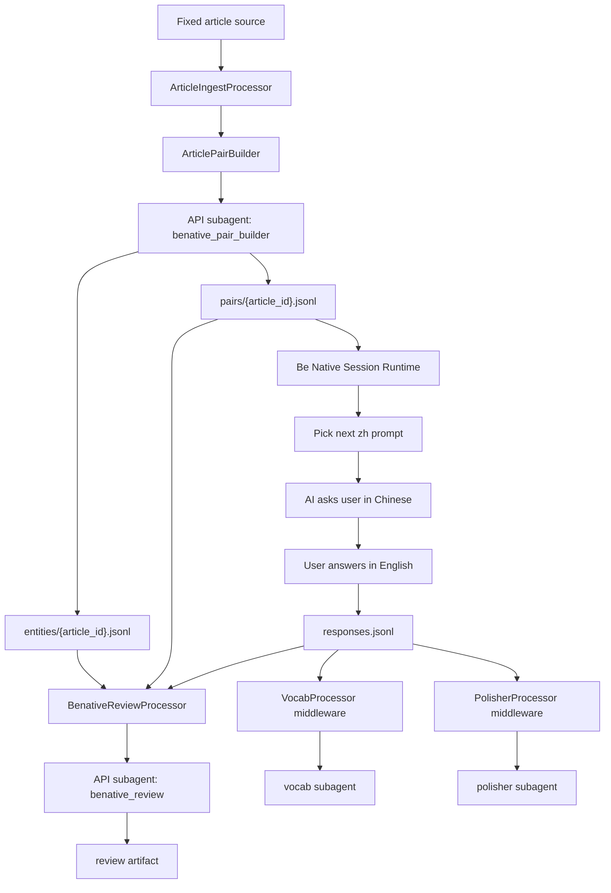

# Be Native Middleware + Subagent Migration Plan

> Scope: migrate Be Native into the same processor-middleware + subagent architecture used by freechat vocab/polisher.

## Current Subagents

Current project subagent directories:

```text
single_session:
  benative_review
  ielts_feedback
  notes
  polisher
  quiz
  vocab

cross_session:
  benative_article_fetcher
  benative_translator
  daily_consolidator
  ielts_exam
  memory_cron
  notes_ai_assistant
  progress_organizer
  progress_tracker
  review
  wiki
```

Be Native currently has:

```text
benative_article_fetcher:
  old agentic idea, fetch web articles

benative_translator:
  old agentic idea, translate article sentence-by-sentence

benative_review:
  old review subagent, compare user English with original English
```

The current Be Native trigger only runs `benative_review` every 10 turns.

## Product Goal

Be Native mode should help the learner practice active English reconstruction from Chinese prompts.

The basic learning loop:

```text
article source
-> AI processing
-> English / Chinese sentence pairs
-> AI asks user in Chinese
-> user answers in English
-> system compares user answer with original English
-> vocab / polisher / review feedback
```

The early version does not need a full agentic article search flow. Fixed local text sources are enough.

Later, an agentic search/news subagent can replace or enrich the fixed text source.

## Target Architecture



## Phase 1 Scope

Use fixed local text materials.

```text
persona/benative/sources/{article_id}.md
```

The source can include frontmatter:

```yaml
---
id: article_001
title: Why Family Meals Matter
topic: family
level: B1
source_type: fixed
---
```

Then body text:

```text
Families often build stronger relationships by spending time together...
```

Phase 1 generated artifacts:

```text
persona/benative/articles/{article_id}.json
persona/benative/pairs/{article_id}.jsonl
persona/benative/entities/{article_id}.jsonl
persona/benative/sessions/{session_uuid}/responses.jsonl
persona/processor/benative/review.jsonl
persona/processor/benative/vocab.jsonl
persona/processor/benative/polisher.jsonl
```

## Article Pair Building

This step is mostly API mode, not agentic.

Input:

```text
fixed English article text
```

Processor responsibilities:

```text
read source md/json
extract metadata
split into paragraphs/sentences
build compact prompt
validate returned sentence pairs
write article json and pair jsonl
```

Subagent responsibilities:

```text
translate English sentences into natural Chinese
preserve sentence_index
preserve entities
return TSV/JSONL-like structured output
```

Output pair:

```jsonl
{"article_id":"article_001","sentence_index":0,"en":"Families often build stronger relationships by spending time together.","zh":"家人经常通过共度时光来建立更牢固的关系。","paragraph_index":0}
```

## Entity Extraction

This should also be API mode at first.

Why it matters:

```text
some entities are hard for learners to spell
speech recognition can benefit from entity hints
review can avoid marking entity names as ordinary vocab mistakes
future graph/wiki can connect topics, people, places, organizations
```

Entity categories:

```text
person
organization
location
product
event
topic_keyword
proper_noun
term
other
```

Output:

```jsonl
{"article_id":"article_001","surface":"Arsenal","type":"organization","canonical":"Arsenal Football Club","zh":"阿森纳足球俱乐部","aliases":["Arsenal"],"source_sentence_indexes":[3,7]}
```

## User Practice Flow

Runtime flow:

```text
select article
load pairs
read current_sentence cursor
send Chinese prompt to user
user answers in English
save response
advance cursor
optionally show original English after answer
trigger processors
```

Question format:

```text
请用英语表达这句话：
“家人经常通过共度时光来建立更牢固的关系。”
```

Saved response:

```jsonl
{"session_uuid":"...","article_id":"article_001","sentence_index":0,"zh":"家人经常通过共度时光来建立更牢固的关系。","original_en":"Families often build stronger relationships by spending time together.","user_en":"Family can build strong relationship when they spend time together.","timestamp":"..."}
```

## Be Native Subagents

### 1. benative_pair_builder

Mode:

```text
api default
agentic future optional
```

Purpose:

```text
convert fixed English article into zh/en sentence pairs
```

Processor:

```text
benative_pair_builder processor
```

### 2. benative_entity_extractor

Mode:

```text
api default
```

Purpose:

```text
extract entities and speech-recognition hints from article text
```

### 3. benative_review

Mode:

```text
api default
agentic optional later
```

Purpose:

```text
compare user English against original English
identify accuracy, grammar, vocab, collocation, sentence structure issues
```

### 4. vocab

Reuse existing subagent and processor.

Be Native-specific focus:

```text
stronger alternatives for user's answer
article-specific collocations
entity-aware vocabulary suggestions
```

### 5. polisher

Reuse existing subagent and processor.

Be Native-specific focus:

```text
rewrite user's answer closer to natural English
explain grammar/sentence structure differences
```

### 6. searchnews

Future agentic subagent.

Purpose:

```text
replace fixed hardcoded articles with interesting current articles
based on user interests, past answers, wiki memory, and target topics
```

Tools:

```text
web_search
web_fetch
wiki_query
user_profile
thread_query
artifact_read
```

This should not be Phase 1 because it adds external data quality, source trust, and cost complexity.

## Suggested Additional Features

### Entity Hints for ASR

Use `entities/{article_id}.jsonl` to build a hint list for speech recognition:

```text
proper nouns
topic keywords
rare terms
names and locations
```

### Difficulty Control

Tag each sentence:

```text
length
grammar pattern
CEFR-ish level
topic
entity density
```

Then practice can choose:

```text
easy first
mixed review
entity-heavy practice
grammar-targeted practice
```

### Answer Reveal Strategy

After user answers, system can show:

```text
original English
literal comparison
one natural alternative
key phrase
```

This should be configurable because too much feedback can interrupt speaking flow.

### Spaced Review

Store difficult sentences and retry later:

```text
persona/processor/benative/review_queue.jsonl
```

### Topic Personalization

Use LLM Wiki / user profile later:

```text
if user likes Arsenal -> football articles
if user likes travel -> city/travel articles
if user is weak on articles/prepositions -> sentence selection emphasizes that
```

## Proposed Config Shape

`mode/benative/trigger/triggers.json` should eventually include:

```json
{
  "id": "benative_review",
  "condition": {
    "kind": "file_line_count",
    "count": 1,
    "scope": "global",
    "path": "persona/benative/sessions/{session_uuid}/responses.jsonl"
  },
  "target": {
    "processor": "benative_review",
    "subagent": "benative_review",
    "execution_mode": "api",
    "tools": [],
    "input_path": "persona/benative/sessions/{session_uuid}/responses.jsonl",
    "output_path": "persona/processor/benative/review.jsonl",
    "model": "deepseek-v4-flash"
  }
}
```

Note: `{session_uuid}` placeholders in trigger file paths may need runtime support. If not available, Phase 1 can write all responses to a global path:

```text
persona/benative/events/responses.jsonl
```

## Implementation Plan

### Step 1. Data Schema

Create Be Native artifact schemas:

```text
ArticleSource
ArticleRecord
SentencePair
ArticleEntity
UserReconstructionResponse
BenativeReviewItem
```

### Step 2. Fixed Article Source Loader

Create processor for:

```text
persona/benative/sources/*.md
-> persona/benative/articles/*.json
```

### Step 3. Pair Builder Processor

Create processor-mediated API subagent:

```text
article text
-> zh/en sentence pairs
-> persona/benative/pairs/{article_id}.jsonl
```

### Step 4. Entity Extractor Processor

Create processor-mediated API subagent:

```text
article text / pairs
-> entities
-> persona/benative/entities/{article_id}.jsonl
```

### Step 5. Practice Runtime

Add Be Native session state:

```text
selected_article_id
current_sentence_index
responses path
```

Add response persistence:

```text
persona/benative/sessions/{session_uuid}/responses.jsonl
```

or global fallback:

```text
persona/benative/events/responses.jsonl
```

### Step 6. Review Processor

Migrate `benative_review` from old file-writing subagent into:

```text
processor middleware
-> API subagent analysis
-> processor validates
-> review.jsonl / review.md
```

### Step 7. Reuse Vocab / Polisher

Add Be Native trigger targets:

```text
benative_vocab
benative_polisher
```

They should read user response events and write:

```text
persona/processor/benative/vocab.jsonl
persona/processor/benative/polisher.jsonl
```

### Step 8. Monitor / WebUI

Monitor should show:

```text
article id
sentence index
pair builder run
entity extractor run
review/vocab/polisher run
api vs agentic mode
```

### Step 9. Future Searchnews Agent

Add only after fixed-source flow works.

```text
searchnews agentic subagent
-> discovers articles
-> stores article candidates
-> pair_builder processes selected candidate
```

## Phase 1 Done Means

```text
fixed article can be loaded
sentence pairs can be generated
entities can be extracted
user can answer English from Chinese prompt
response is persisted
review/vocab/polisher artifacts are generated through processor middleware
monitor shows the full chain
```
