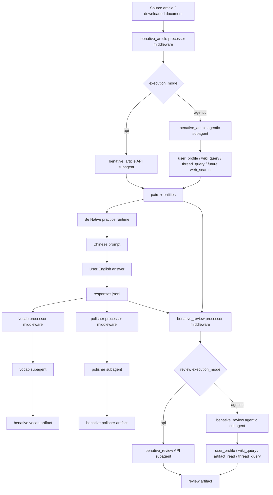

# Be Native Middleware + Subagent Migration Plan

> Goal: build Be Native around the same processor-middleware + subagent architecture as freechat, with four registered subagent capabilities.

## Core Product Flow

Be Native is active reconstruction practice:

```text
article/news material
-> AI creates English/Chinese sentence pairs
-> AI asks in Chinese
-> user answers in English
-> AI reviews the answer against the standard English
-> vocab / polisher / review artifacts are generated
```

The first version should use fixed local article materials or simple downloaded documents.
Later, the article subagent can become agentic and search based on the user's interests and memory.

## Four Registered Capabilities

In this architecture, a subagent is a reusable capability. A mode registers the
capabilities it needs; it does not need to duplicate the implementation.

For Be Native, the four registered capabilities are:

```text
benative_article:
  Be Native-specific material preparation

vocab:
  shared lexical improvement capability already used by freechat

polisher:
  shared expression-polishing capability already used by freechat

benative_review:
  Be Native-specific answer evaluator
```

### 1. benative_article

This is the material preparation subagent.

It replaces the older split between `benative_article_fetcher` and `benative_translator`.

Purpose:

```text
get article material
clean it
split it into sentence-level units
translate into Chinese
extract entities / key terms
write stable learning artifacts
```

API mode:

```text
use fixed local materials or pre-downloaded documents
processor reads source files
LLM translates and extracts entities
processor validates and writes artifacts
```

Agentic mode:

```text
use user_profile / wiki_query / thread_query to infer user interests
use web_search / web_fetch later to find interesting article material
then reuse the same processor validation and storage path
```

Input examples:

```text
persona/benative/sources/{article_id}.md
persona/benative/downloads/{article_id}.txt
```

Output artifacts:

```text
persona/benative/articles/{article_id}.json
persona/benative/pairs/{article_id}.jsonl
persona/benative/entities/{article_id}.jsonl
persona/processor/benative/article.jsonl
```

Sentence pair output:

```jsonl
{"article_id":"article_001","sentence_index":0,"paragraph_index":0,"en":"Families often build stronger relationships by spending time together.","zh":"家人经常通过共度时光来建立更牢固的关系。"}
```

Entity output:

```jsonl
{"article_id":"article_001","surface":"Arsenal","type":"organization","canonical":"Arsenal Football Club","zh":"阿森纳足球俱乐部","aliases":["Arsenal"],"source_sentence_indexes":[3,7]}
```

Why entity extraction belongs here:

```text
the article subagent sees the full source material
entities help users spell unfamiliar names
entities can become ASR hints
review should not treat proper nouns as ordinary vocabulary errors
future wiki graph can connect people / places / topics
```

### 2. vocab

Reuse the same vocab subagent and processor from freechat, but register a Be Native target.

Purpose:

```text
extract lexical improvements from the user's English reconstruction
focus on word choice, collocations, article-specific expressions, topic vocabulary
```

API mode:

```text
read user answer + original English + Chinese prompt
return structured lexical suggestions
processor validates and writes vocab artifact
```

Agentic mode:

```text
optionally use user_profile / wiki_query / artifact_read
personalize suggestions based on recurring vocabulary habits
```

Output:

```text
persona/processor/benative/vocab.jsonl
```

Example:

```text
user: Family can build strong relationship when they spend time together.
standard: Families often build stronger relationships by spending time together.

suggestion:
strong relationship -> stronger relationships
spend time together -> spend quality time together
```

### 3. polisher

Reuse the same polisher subagent and processor from freechat, but register a Be Native target.

Purpose:

```text
polish grammar, sentence structure, natural expression, and fluency
compare user English against the original English without forcing exact memorization
```

API mode:

```text
read user answer + original English + Chinese prompt
return concise rewrite and explanation
```

Agentic mode:

```text
optionally use user_profile / artifact_read to detect repeated grammar habits
```

Output:

```text
persona/processor/benative/polisher.jsonl
```

Example:

```text
user: Family can build strong relationship when they spend time together.
polished: Families can build stronger relationships when they spend time together.
reason: plural noun and comparative adjective make the sentence more natural.
```

### 4. benative_review

This is the evaluator subagent.

Purpose:

```text
compare user's English answer with the standard English sentence
evaluate meaning accuracy, grammar, naturalness, vocabulary, and missing details
produce actionable feedback
```

API mode:

```text
read current response event
read standard sentence pair
return structured review
processor validates and writes review artifact
```

Agentic mode:

```text
use user_profile / wiki_query / artifact_read / thread_query
personalize the feedback using known interests, memories, and recurring mistakes
```

Example agentic behavior:

```text
If the user previously said they like basketball,
the review can suggest:
"You could reuse this pattern for your own topic:
Playing basketball helps me build stronger relationships with my friends."
```

Output:

```text
persona/processor/benative/review.jsonl
persona/sessions/{session_uuid}/notes/benative_review.md
```

## Architecture Diagram



## Data Flow

### Article Preparation

```text
persona/benative/sources/*.md
-> benative_article processor
-> benative_article subagent
-> persona/benative/articles/*.json
-> persona/benative/pairs/*.jsonl
-> persona/benative/entities/*.jsonl
```

### Practice Response

```text
Chinese sentence prompt
-> user English answer
-> persona/benative/events/responses.jsonl
```

Use a global event file first:

```text
persona/benative/events/responses.jsonl
```

This avoids needing `{session_uuid}` placeholders in trigger paths for Phase 1.
Rows still include `session_uuid`, so session-specific display is possible.

Response row:

```jsonl
{"session_uuid":"...","article_id":"article_001","sentence_index":0,"zh":"家人经常通过共度时光来建立更牢固的关系。","standard_en":"Families often build stronger relationships by spending time together.","user_en":"Family can build strong relationship when they spend time together.","timestamp":"..."}
```

### Post-Answer Processing

```text
responses.jsonl
-> vocab
-> polisher
-> benative_review
```

## Proposed Trigger Targets

### benative_article

```json
{
  "id": "benative_article",
  "condition": {
    "kind": "file_line_count",
    "count": 1,
    "scope": "global",
    "path": "persona/benative/sources/index.jsonl"
  },
  "target": {
    "processor": "benative_article",
    "subagent": "benative_article",
    "execution_mode": "api",
    "tools": [],
    "input_path": "persona/benative/sources/index.jsonl",
    "output_path": "persona/processor/benative/article.jsonl",
    "model": "deepseek-v4-flash"
  }
}
```

Agentic version later:

```json
{
  "execution_mode": "agentic",
  "tools": ["user_profile", "wiki_query", "thread_query", "artifact_read"]
}
```

Future web version:

```json
{
  "execution_mode": "agentic",
  "tools": ["user_profile", "wiki_query", "thread_query", "artifact_read", "web_search", "web_fetch"]
}
```

### benative_vocab

```json
{
  "id": "benative_vocab",
  "condition": {
    "kind": "file_line_count",
    "count": 1,
    "scope": "global",
    "path": "persona/benative/events/responses.jsonl"
  },
  "target": {
    "processor": "vocab",
    "subagent": "vocab",
    "execution_mode": "api",
    "tools": [],
    "input_path": "persona/benative/events/responses.jsonl",
    "output_path": "persona/processor/benative/vocab.jsonl",
    "model": "deepseek-v4-flash"
  }
}
```

### benative_polisher

```json
{
  "id": "benative_polisher",
  "condition": {
    "kind": "file_line_count",
    "count": 1,
    "scope": "global",
    "path": "persona/benative/events/responses.jsonl"
  },
  "target": {
    "processor": "polisher",
    "subagent": "polisher",
    "execution_mode": "api",
    "tools": [],
    "input_path": "persona/benative/events/responses.jsonl",
    "output_path": "persona/processor/benative/polisher.jsonl",
    "model": "deepseek-v4-flash"
  }
}
```

### benative_review

```json
{
  "id": "benative_review",
  "condition": {
    "kind": "file_line_count",
    "count": 1,
    "scope": "global",
    "path": "persona/benative/events/responses.jsonl"
  },
  "target": {
    "processor": "benative_review",
    "subagent": "benative_review",
    "execution_mode": "api",
    "tools": [],
    "input_path": "persona/benative/events/responses.jsonl",
    "output_path": "persona/processor/benative/review.jsonl",
    "model": "deepseek-v4-flash",
    "depends_on": "benative_polisher"
  }
}
```

Agentic review version:

```json
{
  "execution_mode": "agentic",
  "tools": ["user_profile", "wiki_query", "thread_query", "artifact_read"]
}
```

## Capability Registry Target

`config/capabilities.yaml` should eventually express:

```yaml
modes:
  benative:
    subagents: [benative_article, vocab, polisher, benative_review]

# vocab and polisher remain shared capability definitions.
# Be Native only adds trigger targets and output paths for this mode.

subagents:
  benative_article:
    execution_modes: [api, agentic]
    default_execution_mode: api
    tools:
      api: []
      agentic: [user_profile, wiki_query, thread_query, artifact_read]

  benative_review:
    execution_modes: [api, agentic]
    default_execution_mode: api
    tools:
      api: []
      agentic: [user_profile, wiki_query, thread_query, artifact_read]
```

## Implementation Plan

### Step 1. Define Be Native Schemas

Create shared schemas:

```text
ArticleRecord
SentencePair
ArticleEntity
BenativeResponse
BenativeReviewItem
```

### Step 2. Add benative_article Processor + Subagent Prompt

Status: done.

Build:

```text
subagent/cross_session/benative_article/processor
subagent/cross_session/benative_article/context/benative_article_subagent.md
```

It should produce:

```text
articles/*.json
pairs/*.jsonl
entities/*.jsonl
processor/benative/article.jsonl
```

### Step 3. Add Be Native Response Event Shape

Status: done.

Persist every user reconstruction answer to:

```text
persona/benative/events/responses.jsonl
```

### Step 4. Add benative_review Processor

Status: done.

Migrate old `benative_review` from file-writing subagent to:

```text
processor middleware
-> benative_review subagent
-> processor validates review
-> review.jsonl / review.md
```

### Step 5. Register Four Triggers

Status: done.

Add:

```text
benative_article
benative_vocab
benative_polisher
benative_review
```

### Step 6. Register Capabilities

Update:

```text
config/capabilities.yaml
```

### Step 7. Monitor Verification

Monitor should show for each run:

```text
subagent
processor
execution_mode
tools
article_id
sentence_index
input/output rows
```

## Phase 1 Done Means

```text
four Be Native subagents are registered
benative_article can create sentence pairs and entities from fixed material
user responses are saved as Be Native events
vocab / polisher / review run through middleware
agentic mode is available by config but API mode is default
monitor can show the full chain
```
