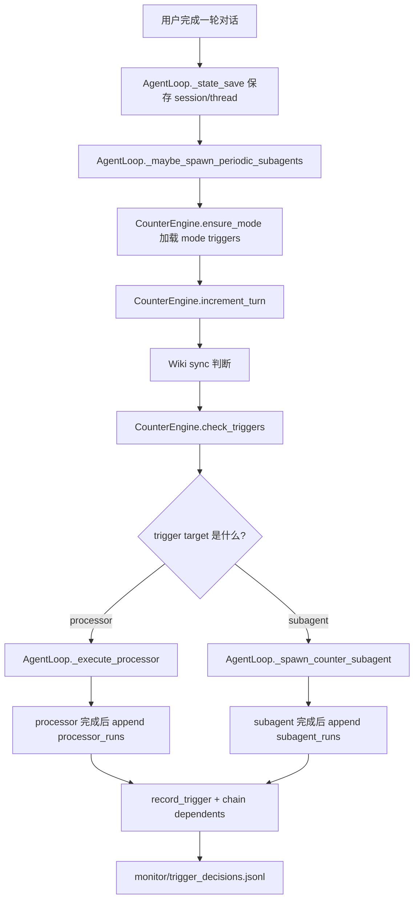
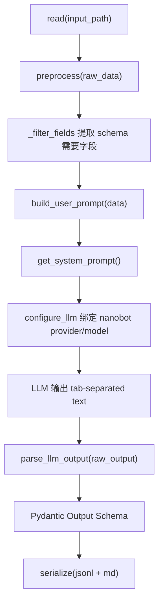
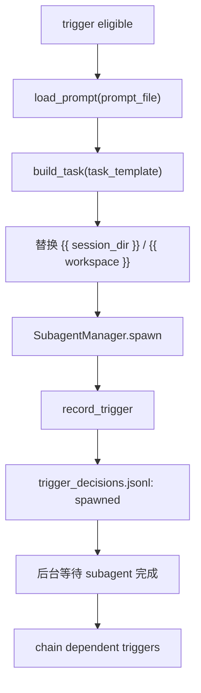
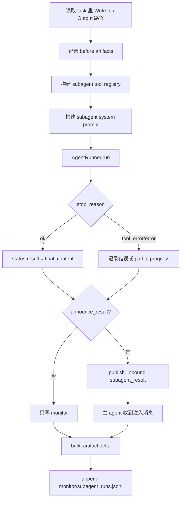

# Processor 与 Spawn Subagent 运行机制

本文档用于熟悉项目中 **trigger -> processor / subagent** 的完整执行流程。重点解释：

- 如何从配置控制调用频次；
- processor 和 subagent 分别在什么场景被调用；
- processor 如何做增量输入、LLM 调用、结构化输出和运行监控；
- subagent 如何被 spawn、如何执行任务、如何把结果写入 monitor 或回注给主 agent。

---

## 1. 配置入口

项目里有两类相关配置：

| 配置文件 | 作用 |
|----------|------|
| `mode/{mode}/trigger/triggers.json` | 真正控制 trigger、调用频次、processor/subagent target |
| `config/capabilities.yaml` | 能力注册表，用于查看有哪些 mode、subagent、processor、monitor 输出 |

虽然有 `capabilities.yaml`，但 **调用频次不是在 yaml 中配置**，而是在各 mode 的 `triggers.json` 里配置。

典型位置：

```text
mode/default/trigger/triggers.json
mode/freechat/trigger/triggers.json
mode/ielts/trigger/triggers.json
mode/benative/trigger/triggers.json
```

统一能力索引：

```text
config/capabilities.yaml
```

---

## 2. Trigger 配置格式

一个 trigger 大致长这样：

```json
{
  "id": "ielts_vocab_processor",
  "name": "IELTS Vocab Processor",
  "enabled": true,
  "condition": {
    "kind": "file_line_count",
    "count": 2,
    "scope": "global",
    "path": "persona/events/thread.jsonl"
  },
  "target": {
    "processor": "vocab",
    "input_path": "persona/events/thread.jsonl",
    "output_path": "persona/processor/ielts/vocab.jsonl",
    "batch_size": 20,
    "model": "deepseek-v4-flash"
  },
  "cursor": {
    "offset": 8,
    "last_checked": null
  }
}
```

字段含义：

| 字段 | 含义 |
|------|------|
| `id` | trigger 唯一 ID，monitor 和 cursor 都用它关联 |
| `enabled` | 是否启用 |
| `condition.kind` | 触发类型：`turn_count`、`file_line_count`、`cron` |
| `condition.count` | 统一频次字段 |
| `condition.path` | `file_line_count` 监听的文件 |
| `target.processor` | 命中后执行 processor |
| `target.subagent` | 命中后 spawn subagent |
| `target.depends_on` | 当前 trigger 等某个 trigger 完成后再执行 |
| `target.model` | 当前 processor/subagent 的模型覆盖值 |
| `target.batch_size` | processor 每批处理多少条输入 |
| `cursor.offset` | 文件行数 cursor 的初始值；运行时 cursor 会写入 persona 下的 runtime cursor |

### 2.1 两种频次

#### file_line_count

```json
"condition": {
  "kind": "file_line_count",
  "count": 2,
  "scope": "global",
  "path": "persona/events/thread.jsonl"
}
```

含义：当 `persona/events/thread.jsonl` 相比上次 cursor 多了至少 2 行，就触发。

适合：

- vocab
- polisher
- notes
- progress_tracker

这些 processor 直接吃原始 conversation event。

#### turn_count

```json
"condition": {
  "kind": "turn_count",
  "count": 5,
  "scope": "session"
}
```

含义：当前 session 每完成 N 轮用户对话触发一次。

适合：

- IELTS feedback subagent：每 5 轮生成一次综合反馈；
- review/quiz/progress_organizer processor：每轮检查一次上游 artifact 是否有新增内容。

### 2.2 depends_on 链式触发

例如 freechat 的 processor 链：

```text
vocab
  -> polisher
    -> notes
      -> progress_tracker
        -> review
          -> quiz
        -> progress_organizer
```

在 `CounterEngine.check_triggers()` 中，带 `depends_on` 的 trigger 不会在第一轮检查里直接触发，而是先被标记为：

```text
waiting_for_dependency
```

等上游 processor/subagent 完成后，`AgentLoop._chain_dependent_triggers()` 会手动继续调用下游 trigger。

---

## 3. 总流程图



主入口代码：

| 文件 | 方法 | 作用 |
|------|------|------|
| `bot/nanobot/agent/loop.py` | `_maybe_spawn_periodic_subagents()` | 一轮对话完成后触发检查 |
| `bot/nanobot/counter/engine.py` | `check_triggers()` | 根据配置判断哪些 trigger eligible |
| `bot/nanobot/agent/loop.py` | `_spawn_counter_subagent()` | 根据 target 分发到 processor 或 subagent |
| `bot/nanobot/agent/loop.py` | `_execute_processor()` | 执行 processor |
| `bot/nanobot/agent/subagent.py` | `SubagentManager.spawn()` | 创建后台 subagent task |

---

## 4. CounterEngine：如何判断是否触发

`CounterEngine` 启动时会加载：

1. `mode/default/trigger/triggers.json`
2. 当前 session mode 对应的 `mode/{mode}/trigger/triggers.json`

当前 mode 从 session metadata 中读取：

```python
session.metadata.get("mode")
```

每轮完成后：

```python
self.counter_engine.increment_turn(session.metadata)
```

然后：

```python
triggers = self.counter_engine.check_triggers(session.metadata)
```

### 4.1 file_line_count 判断

逻辑：

1. 找到 `condition.path`，例如 `persona/events/thread.jsonl`；
2. 读取 runtime cursor offset；
3. 统计当前 total lines；
4. 计算 `unprocessed = total_lines - cursor_offset`；
5. 如果 `unprocessed >= count`，trigger eligible。

运行时 cursor 写入：

```text
persona/trigger/count/.cursor_{trigger_id}.json
```

例如：

```json
{
  "offset": 42,
  "last_checked": "2026-06-04T10:00:00Z"
}
```

### 4.2 turn_count 判断

逻辑：

1. 当前 session metadata 中维护 `_counter_turn_count`；
2. 每轮加 1；
3. 当 `turn_count % count == 0` 时触发；
4. 用 `_counter_last_trigger_{trigger_id}` 避免同一 turn 重复触发。

---

## 5. Processor Pipeline

Processor 是当前学习数据处理的主线。它适合：

- 从对话里抽词汇、表达、语法问题；
- 从二级 artifact 里生成复习点；
- 从复习点生成 quiz；
- 需要稳定结构化输出，但不需要让一个完整 agent 自己读写多个文件。

### 5.1 为什么用 processor，而不是让 subagent 直接输出 JSON

原始思路是让 subagent/LLM 输出 JSON，然后写文件。但这样有几个问题：

- LLM 输出 JSON 容易格式错；
- prompt 里必须重复写完整 schema，token 消耗高；
- 每个 subagent 都要自己处理读取、去重、写入、格式化；
- monitor 很难统一记录输入行数、输出行数、cursor、token usage。

现在的 processor 方式是：

```text
LLM 只输出简单 tab-separated 文本
Processor 负责 parse + schema validation + jsonl/md serialization
```

这样把“不稳定的语言生成”和“稳定的数据工程”分开：

- LLM 负责判断和生成内容；
- Python processor 负责结构化、校验、落盘、监控。

### 5.2 BaseDataProcessor 父类流程

父类在 `subagent/_shared/base.py`。

它规范了所有 processor 的通用流程：



子类必须实现：

| 方法 | 作用 |
|------|------|
| `get_input_schema()` | 定义从输入 JSONL 里需要哪些字段 |
| `get_output_schema()` | 定义输出结构 |
| `build_user_prompt()` | 把输入数据组装成当前任务的 prompt |
| `parse_llm_output()` | 把 LLM 文本解析为 Pydantic 输出 |
| `to_md()` | 生成对应 Markdown 报告 |
| `get_system_prompt()` | 可选，定义任务说明和输出格式 |

### 5.3 Registry 自动发现

registry 在：

```text
subagent/_shared/registry.py
```

它扫描：

```text
subagent/single_session/*/processor/
subagent/cross_session/*/processor/
```

只要目录里存在继承 `BaseDataProcessor` 的类，就会注册到：

```python
processors[name] = cls
```

例如：

| processor name | 类 | 位置 |
|----------------|----|------|
| `vocab` | `VocabProcessor` | `subagent/single_session/vocab/processor/processor.py` |
| `polisher` | `PolisherProcessor` | `subagent/single_session/polisher/processor/processor.py` |
| `notes` | `NotesProcessor` | `subagent/single_session/notes/processor/processor.py` |
| `review` | `ReviewProcessor` | `subagent/cross_session/review/processor/review_processor.py` |
| `quiz` | `QuizProcessor` | `subagent/single_session/quiz/processor/processor.py` |
| `progress_tracker` | `ProgressTrackerProcessor` | `subagent/cross_session/progress_tracker/processor/processor.py` |

### 5.4 AgentLoop 执行 processor

当 trigger target 有：

```json
"target": {
  "processor": "vocab"
}
```

就进入：

```text
AgentLoop._execute_processor()
```

流程：

1. `discover_processors()` 找到 processor class；
2. 实例化 processor；
3. `configure_llm(provider, model, retry_mode)` 绑定当前 nanobot provider；
4. `materialize_processor_delta()` 创建本次只包含新增行的临时 JSONL；
5. 调用 `processor.aprocess_all(...)`；
6. 统计 output 新增行数；
7. 更新 processor cursor；
8. 写入 `monitor/processor_runs.jsonl`；
9. `record_trigger()` 更新 trigger cursor；
10. 如果有新增输出，继续 chain 下游依赖 trigger。

### 5.5 增量输入机制

processor 有两种 cursor。

#### 第一层：file_line_count cursor

例如 vocab/polisher/notes 读取：

```text
persona/events/thread.jsonl
```

cursor 来自 trigger 自己：

```text
persona/trigger/count/.cursor_freechat_vocab_processor.json
```

本次运行只读取 cursor 之后的新行。

#### 第二层：processor artifact cursor

例如 review 读取多个二级 artifact：

```text
persona/processor/freechat/vocab.jsonl
persona/processor/freechat/polisher.jsonl
persona/processor/freechat/notes.jsonl
```

它不适合用 thread cursor，所以使用：

```text
persona/trigger/processor/.cursor_freechat_review_processor.json
```

里面按输入文件分别记录 offset。

这样 review/quiz/progress_organizer 不会重复处理旧 artifact。

### 5.6 VocabProcessor 真实例子

假设新对话里用户说：

```text
i played basketball yesterday and made 3 points
```

输入 `persona/events/thread.jsonl` 里是完整 event。`BaseDataProcessor._filter_fields()` 会提取 `VocabInput` 需要的字段：

```python
class VocabInput(BaseModel):
    id: str | None = None
    role: str
    content: str
    topic: str | None = None
    mode: str | None = None
```

`VocabProcessor.build_user_prompt()` 只保留 user 说的话：

```text
用户说: i played basketball yesterday and made 3 points
```

LLM 被要求输出 tab-separated：

```text
3 points    three-point shot    expression    在篮球语境中更专业
```

`VocabProcessor.parse_llm_output()` 把它转成：

```json
{
  "original": "3 points",
  "improved": "three-point shot",
  "type": "expression",
  "reason": "在篮球语境中更专业"
}
```

最后写入：

```text
persona/processor/freechat/vocab.jsonl
persona/processor/freechat/vocab.md
```

### 5.7 ReviewProcessor 真实例子

ReviewProcessor 是更高一层的 processor。它不直接吃原始 thread，而是吃二级 artifact：

```text
vocab.jsonl
polisher.jsonl
notes.jsonl
```

例如 vocab 已经产生：

```json
{"original":"3 points","improved":"three-point shot","type":"expression","reason":"在篮球语境中更专业"}
```

ReviewProcessor 会把它转成 review input：

```text
3 points -> three-point shot (expression): 在篮球语境中更专业
```

再让 LLM 生成复习点：

```text
three-point shot    sentence_use    3    sports
```

最后写入：

```text
persona/processor/freechat/review.jsonl
persona/processor/freechat/review.md
```

---

## 6. Spawn Subagent Pipeline

Subagent 适合：

- 需要一个 agent 自己读多个文件、调用工具、写入文件；
- 任务比较开放，不只是抽取结构化字段；
- 需要独立运行、等待完成、再把结果回注给主 agent；
- 例如 IELTS 5 轮后的综合反馈。

### 6.1 Trigger 配置例子

IELTS feedback 是典型 subagent trigger：

```json
{
  "id": "ielts_feedback",
  "name": "IELTS Feedback",
  "enabled": true,
  "condition": {
    "kind": "turn_count",
    "count": 5,
    "scope": "session"
  },
  "target": {
    "subagent": "ielts_feedback",
    "prompt_file": "subagent/single_session/ielts_feedback/context/ielts_feedback_subagent.md",
    "model": "deepseek-v4-flash",
    "task_template": "Provide IELTS-specific feedback on the conversation.\n\nSession directory: {session_dir}/notes/\nRead: {session_dir}/thread.jsonl\nWrite to: {session_dir}/notes/ielts_feedback.md\n\nFocus on:\n- IELTS speaking criteria..."
  }
}
```

含义：

- 每 5 轮触发一次；
- 加载专用 prompt 文件；
- 构建 task；
- 使用 `deepseek-v4-flash`；
- 要求 subagent 读取 session thread 并写入 `ielts_feedback.md`。

### 6.2 AgentLoop spawn 流程

当 target 有：

```json
"subagent": "ielts_feedback"
```

就走：

```text
AgentLoop._spawn_counter_subagent()
```

流程：



### 6.3 SubagentManager.spawn

`SubagentManager.spawn()` 做这些事：

1. 生成 8 位 `task_id`；
2. 解析模型：显式 `model` > subagent defaults > runtime default；
3. 创建 `SubagentStatus`；
4. `asyncio.create_task()` 启动 `_run_subagent()`；
5. 把 task 记录到 `_running_tasks` 和 `_session_tasks`；
6. 返回 `task_id`。

这意味着 subagent 是后台执行的，不阻塞主回复流程。

### 6.4 _run_subagent 执行过程

`_run_subagent()` 是真正执行任务的地方：



关键点：

- subagent 有隔离的 tool registry；
- prompt 由 `agent/subagent_system.md` 加上业务 prompt 拼成；
- hook 会记录 tool events、usage、iteration；
- 如果 `announce_result=true`，结果会作为 `subagent_result` 注入主 agent；
- 如果 `announce_result=false`，只写文件和 monitor，不打扰用户对话。

### 6.5 Subagent result 如何回到主 agent

如果需要回注，`_announce_result()` 会构造一条 system inbound message：

```python
InboundMessage(
    channel="system",
    sender_id="subagent",
    content=announce_content,
    metadata={
        "injected_event": "subagent_result",
        "subagent_task_id": task_id
    }
)
```

主 agent 的 pending queue 会收到这条消息，然后在后续 prompt 中看到 subagent 结果。

这就是“subagent 回复也能显示在 monitor / WebUI，并且能独立查看”的基础。

### 6.6 Artifact 记录

Subagent 会尝试从 task 里提取输出文件路径：

```text
Write to: /path/to/file.md
Output: /path/to/file.jsonl
```

运行前保存 before snapshot，运行后比较 after：

| 状态 | 含义 |
|------|------|
| `created` | 新建文件 |
| `appended` | 文件追加内容 |
| `changed` | 文件发生非追加式变化 |
| `unchanged` | 文件没有变化 |
| `missing` | 任务声明了文件但没有生成 |
| `error` | 读取 artifact 时出错 |

这些会写进：

```text
monitor/subagent_runs.jsonl
```

---

## 7. Monitor 与可观测性

当前有三个核心运行日志：

| 文件 | 内容 |
|------|------|
| `monitor/trigger_decisions.jsonl` | 每个 trigger 为什么 eligible、skipped、spawned、failed |
| `monitor/processor_runs.jsonl` | processor 输入行数、输出行数、cursor、usage、output_preview |
| `monitor/subagent_runs.jsonl` | subagent task、结果、tool events、usage、artifact delta |

### 7.1 trigger_decisions.jsonl

典型记录：

```json
{
  "trigger_id": "freechat_vocab_processor",
  "kind": "file_line_count",
  "decision": "eligible",
  "reason": "file_line_count_threshold_met",
  "turn_count": 2,
  "details": {
    "total_lines": 12,
    "unprocessed": 2,
    "count": 2
  }
}
```

它回答的是：

```text
为什么这次触发/没触发？
```

### 7.2 processor_runs.jsonl

典型记录：

```json
{
  "trigger_id": "freechat_vocab_processor",
  "processor": "vocab",
  "status": "completed",
  "model": "deepseek-v4-flash",
  "input_rows": 2,
  "output_rows": 1,
  "cursor_kind": "file_line_count",
  "output_preview": [
    {
      "original": "3 points",
      "improved": "three-point shot"
    }
  ]
}
```

它回答的是：

```text
processor 这次处理了哪些增量，产出了什么？
```

### 7.3 subagent_runs.jsonl

典型记录：

```json
{
  "task_id": "a1b2c3d4",
  "label": "ielts_feedback",
  "phase": "done",
  "model": "deepseek-v4-flash",
  "result": "Feedback saved successfully.",
  "artifacts": [
    {
      "path": ".../notes/ielts_feedback.md",
      "status": "created",
      "delta": "# IELTS Speaking Feedback..."
    }
  ]
}
```

它回答的是：

```text
哪个 subagent 被调用了、做了什么、写了哪些文件、结果是什么？
```

---

## 8. Processor vs Subagent：如何区分使用场景

| 维度 | Processor | Subagent |
|------|-----------|----------|
| 主要目标 | 稳定结构化抽取和落盘 | 开放式任务执行 |
| 输入 | JSONL / artifact 增量 | 自然语言 task + prompt |
| 输出 | Pydantic -> JSONL/MD | final response + 文件 artifact |
| LLM 输出格式 | 简单 tab-separated 文本 | 自然语言或工具调用结果 |
| 是否使用工具 | 通常不使用 | 可以使用 read/write/search/exec 等工具 |
| 是否后台运行 | 是，但通常短任务 | 是，可能更长 |
| 是否回注主 agent | 通常不回注 | 可选 `announce_result` |
| 典型任务 | vocab、polisher、review、quiz | IELTS feedback、notes AI reply、跨文件整理 |

判断原则：

- 如果任务是“从已有数据抽取结构化记录”，优先 processor。
- 如果任务是“读多个文件、综合判断、写报告、可能需要工具”，用 subagent。
- 如果需要非常稳定的输出格式，不要让 LLM 直接写 JSON，优先 processor parse。
- 如果需要复杂 agentic 行为，允许 subagent 自己规划工具调用。

当前 freechat 的 agentic subagent 已经有硬工具边界：

```text
trigger.target.tools
-> AgentLoop._run_processor_agentic_subagent()
-> SubagentManager.spawn(allowed_tools=[...])
-> ToolRegistry.filtered()
-> AgentRunner only sees allowlisted tools
```

第一批只读工具在：

```text
bot/nanobot/agent/tools/subagent_context.py
```

包括：

| Tool | 用途 |
|------|------|
| `thread_query` | 读取 `persona/events/thread.jsonl` 中最近对话 |
| `artifact_read` | 读取 `persona/processor/**` 和 `monitor/**` 的 artifact/log |
| `user_profile` | 读取 `persona/USER.md` 和 `persona/memory/MEMORY.md` |
| `wiki_query` | 查询本地 LLM Wiki |

---

## 9. 用一个真实对话串起来

假设用户在 IELTS/freechat 里说：

```text
i like basketball and my favorite football team is arsenal.
i want to travel to paris to watch a match.
```

### 第 1 步：对话保存

主 agent 回复用户后，session 和全局事件流被保存：

```text
persona/sessions/{session_uuid}/thread.jsonl
persona/events/thread.jsonl
```

### 第 2 步：trigger 检查

`freechat_vocab_processor` 监听：

```text
persona/events/thread.jsonl
```

如果新增行数达到 `count=2`，它变成 eligible。

### 第 3 步：vocab processor

processor 只拿 cursor 后的新行，提取用户文本，可能输出：

```json
{"original":"football team","improved":"football club","type":"vocabulary","reason":"谈论 Arsenal 时 club 更自然"}
```

写入：

```text
persona/processor/freechat/vocab.jsonl
persona/processor/freechat/vocab.md
```

### 第 4 步：polisher/notes/progress_tracker 链式执行

因为它们配置了 `depends_on`，会在上游完成后继续运行。

例如 notes 可能捕获：

```json
{"title":"Sports travel expression","content":"User wants to describe traveling to Paris to watch a match."}
```

### 第 5 步：review/quiz 处理二级 artifact

review 不直接吃 thread，而是吃：

```text
vocab.jsonl
polisher.jsonl
notes.jsonl
```

生成复习点：

```json
{"review_point":"football club","question_type":"sentence_use","familiarity_hint":2,"topic":"sports"}
```

quiz 再基于 review 生成题目。

### 第 6 步：IELTS feedback subagent

如果当前是 IELTS mode，且 turn count 到 5，`ielts_feedback` subagent 被 spawn：

```text
Read: {session_dir}/thread.jsonl
Write to: {session_dir}/notes/ielts_feedback.md
```

它会独立读取整段 session，生成综合 IELTS 反馈。

### 第 7 步：monitor 可查看

你可以在 monitor 里看：

```text
trigger_decisions.jsonl  -> 为什么触发
processor_runs.jsonl    -> processor 增量输入/输出
subagent_runs.jsonl     -> subagent 结果和 artifact
```

---

## 10. 当前需要特别记住的边界

1. Processor 是当前学习数据主线，不等于 subagent。
2. `target.processor` 和 `target.subagent` 是两个不同执行分支。
3. `depends_on` 的下游 trigger 不会在普通 `check_triggers()` 中直接触发，而是在上游完成后 chain。
4. Processor 当前通过 tab-separated 输出降低 token 和格式错误风险。
5. Processor 增量机制有两层 cursor：原始 thread cursor 与 artifact processor cursor。
6. Subagent 结果会写入 `monitor/subagent_runs.jsonl`，是否回注主 agent 取决于 `announce_result`。
7. 调用频次主要改 `mode/{mode}/trigger/triggers.json` 中的 `condition.count`。
8. `config/capabilities.yaml` 主要用于全局能力索引，不是运行时频次的实际来源。
