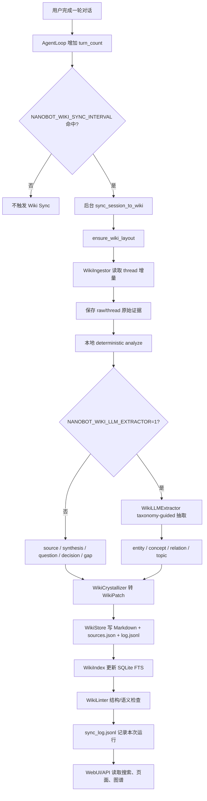
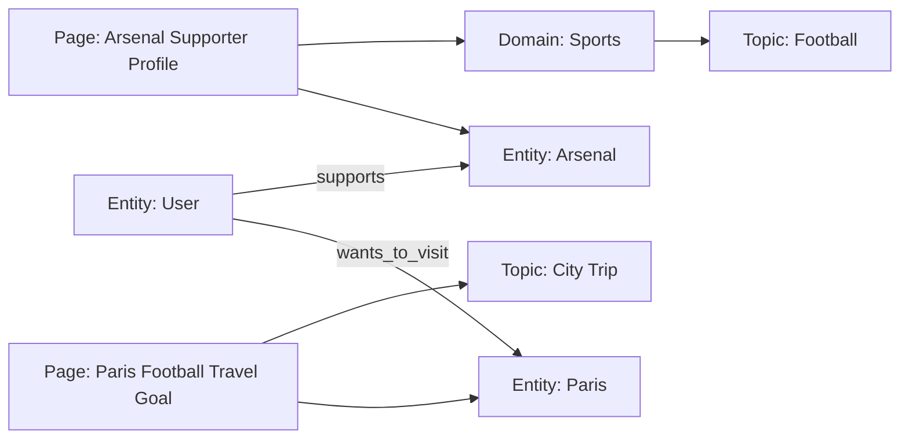

# Wiki Memory 功能实现文档

本文档详细说明项目中的 **Wiki Memory**（LLM Wiki 记忆系统）功能的完整实现，包括数据存储、索引搜索、知识图谱、补丁处理、API 接口以及前端交互。

---

## 1. 功能概述

Wiki Memory 是一个面向 LLM 的持久化知识库系统，用于：
- **结构化存储**：以 Markdown + YAML Frontmatter 格式保存知识页面
- **全文检索**：基于 SQLite FTS5 实现全文搜索
- **知识图谱**：可视化 domain、topic、entity、concept、relation 等用户知识关系
- **增量更新**：从 thread 增量 ingest，也支持 WikiPatch 机制从 LLM 输出增量写入知识
- **来源追踪**：每条知识附带来源（会话 ID、消息 ID 等），支持可信度管理

---

## 2. 当前运行全流程（代码视角）

当前 LLM Wiki 有两条入口：

1. **自动同步入口**：用户完成一轮对话后，`AgentLoop` 通过 turn counter 判断是否触发 wiki sync。
2. **显式读写入口**：WebUI/API 或 agent tool 直接搜索、读取、应用 patch、获取图谱。

自动同步入口代码位置：

- `bot/nanobot/agent/loop.py`
  - `_maybe_spawn_periodic_subagents()`：每轮对话完成后计数。
  - `_should_sync_wiki()`：读取 `NANOBOT_WIKI_SYNC_INTERVAL` 判断是否触发。
  - `_sync_wiki_for_session()`：后台调用 wiki sync。
- `bot/nanobot/agent/wiki_sync.py`
  - `sync_session_to_wiki()`：执行 `ingest -> analyze/extract -> crystallize -> lint -> log`。



### 2.1 触发频率

`NANOBOT_WIKI_SYNC_INTERVAL` 控制触发频率：

| 配置 | 行为 |
|------|------|
| 未设置或 `1` | 每轮用户对话结束后触发一次 |
| `2` | 每 2 轮触发一次 |
| `3` | 每 3 轮触发一次 |
| `0` 或负数 | 关闭自动 wiki sync |

这个触发逻辑已经和 subagent trigger 解耦。也就是说：subagent 是否被调用，不影响 wiki sync 是否触发。

### 2.2 Ingest：读取增量 thread

`WikiIngestor.ingest_thread_delta()` 负责读取 thread 增量，并保存 raw evidence。

当前代码读取路径：

```python
workspace / "data" / "thread.jsonl"
```

然后按 session 维护 cursor：

```text
persona/wiki/state/ingest_cursor.json
```

成功读取到新消息后，会写入：

```text
persona/wiki/raw/thread/{timestamp}.jsonl
```

当前 canonical thread 来源是：

```text
persona/events/thread.jsonl
persona/sessions/{session_id}/thread.jsonl
```

其中自动 wiki sync 默认读取 `persona/events/thread.jsonl`，并通过 `config/capabilities.yaml -> processors.wiki.sync.allowed_modes / allowed_roles` 控制哪些内容可以进入长期记忆。当前默认只允许 `freechat` 的 `user` turns，避免 Be Native 文章模仿、系统命令或 assistant 回复污染用户真实画像。

### 2.3 Deterministic Analyze：默认本地抽取

默认不开 LLM extractor 时，`WikiIngestor.analyze()` 会做稳定的本地规则抽取：

| 候选类型 | 触发条件 | 用途 |
|----------|----------|------|
| `source` | batch 内有任意文本 | 保存一批原始对话信号 |
| `question` | 包含 `?`，或以 why/how/what/when/where 开头 | 保存用户提出的问题 |
| `decision` | 包含 decide、decision、决定、按照、采用 | 保存决策类信息 |
| `gap` | 包含 gap、missing、不足、缺口、不确定 | 保存知识缺口 |
| `synthesis` | batch 内有用户文本 | 汇总最近用户信号 |

这个阶段不会主动把 `basketball / Paris / Arsenal` 拆成 entity 或 relation。它的设计目标是低成本、稳定、不会因为 LLM JSON 输出不稳定而污染 wiki。

### 2.4 Taxonomy-Guided LLM Extractor：可选 LLM 抽取

开启方式：

```bash
NANOBOT_WIKI_LLM_EXTRACTOR=1
```

开启后，`WikiLLMExtractor` 会把一批 `IngestMessage` 发给当前 provider，并要求模型输出 JSONL。模型必须使用 `config/wiki_taxonomy.yaml` 中预定义的 domain/topic/subtype。

例如用户说：

```text
I like basketball. I enjoy traveling.
I want to go to Paris to watch football, and my favorite team is Arsenal.
```

理想 LLM 输出类似：

```jsonl
{"domain":"sports","topic":"basketball","subtype":"preference","wiki_type":"concept","title":"Basketball Interest","content":"User likes basketball.","entities":["basketball"],"relations":[{"subject":"user","predicate":"likes","object":"basketball"}],"source_refs":["thread:s1:m2"],"confidence":"high"}
{"domain":"sports","topic":"football","subtype":"favorite_team","wiki_type":"entity","title":"Arsenal Supporter Profile","content":"User's favorite football club is Arsenal.","entities":["Arsenal"],"relations":[{"subject":"user","predicate":"supports","object":"Arsenal"}],"source_refs":["thread:s1:m2"],"confidence":"high"}
{"domain":"travel","topic":"city_trip","subtype":"travel_goal","wiki_type":"concept","title":"Paris Football Travel Goal","content":"User wants to travel to Paris and watch football there.","entities":["Paris","football"],"relations":[{"subject":"user","predicate":"wants_to_visit","object":"Paris"}],"source_refs":["thread:s1:m2"],"confidence":"medium"}
```

解析后会生成带有 taxonomy 标签的 `WikiCandidate`：

```text
domain:sports
topic:football
subtype:favorite_team
entity:Arsenal
llm-extracted
```

如果模型输出的 taxonomy 不合法，会被归到 fallback：

```text
other/uncategorized/unknown
```

同时写入 topic review queue：

```text
persona/wiki/state/topic_review_queue.jsonl
```

这为后续“多次谈到某类内容后，是否新增大类/小类主题”提供了工程入口。

### 2.5 Crystallize：候选知识结晶

`WikiCrystallizer` 把 `WikiCandidate` 转为 `WikiPatch`。

它会先用 `WikiQueryEngine` 查询现有页面：

- 如果已有相似页面且 score 足够高，合并到旧页面。
- 如果没有相似页面，新建 slug。

例子：

```text
entity/arsenal-supporter-profile-xxxx
concept/paris-football-travel-goal-xxxx
synthesis/recent-user-signals-xxxx
```

默认 patch 操作是 `merge_section`，也就是往对应 section 合并 bullet，并通过 `.sources.json` 做事实去重和来源累积。

### 2.6 Store：Markdown + sources sidecar + log

`WikiStore.apply_patch()` 负责真正落盘：

```text
persona/wiki/wiki/{type}/{slug}.md
persona/wiki/wiki/{type}/{slug}.sources.json
persona/wiki/log.jsonl
```

Markdown 页包含 frontmatter：

```yaml
---
slug: entity/arsenal-supporter-profile
title: Arsenal Supporter Profile
type: entity
mode: freechat
tags:
  - domain:sports
  - topic:football
  - subtype:favorite_team
  - entity:Arsenal
topics:
  - sports/football
sources:
  - thread:s1:m2
confidence: high
---
```

`.sources.json` 保存每条 fact 的来源、确认次数、first_seen、last_seen。相同事实再次出现时，不重复写入正文 bullet，而是增加 confirmations 并合并 sources。

### 2.7 Index、Query、Graph

写页成功后，`WikiIndex.index_page()` 会把页面按 section 切成 chunk，写入 SQLite FTS：

```text
persona/wiki/index/wiki.sqlite
```

`WikiQueryEngine` 会组合：

- SQLite FTS 搜索
- Markdown/title/tags/topics 扫描
- link 邻居扩展

`build_wiki_graph()` 则把 wiki 投影成面向用户的知识图谱。后端只返回稳定的 graph data，前端再根据用户选择投影成“总览图”“层级图”或“聚焦子图”。核心节点包括：

- `domain`
- `topic`
- `page`
- `entity`
- `concept`

关系包括：

- `has_domain`
- `has_topic`
- `contains_topic`
- `mentions_entity`
- `mentions_concept`
- `relation:{predicate}`

上面的 Arsenal 例子可视化后接近：



前端可以进一步把 `sports/football` 或 `entity:Arsenal` 设为当前起点，只展示两跳内的局部子图，用于回答“这个 topic 下沉淀了哪些事实、表达素材和页面”。

---

## 3. 架构总览

```
┌─────────────────────────────────────────────────────────────────────────────┐
│                              前端 (React / WebUI)                            │
│  ┌─────────────────┐  ┌─────────────────┐  ┌─────────────────┐             │
│  │ WikiMemoryPanel │  │ WikiGraphView   │  │ Sidebar Button  │             │
│  │  - 搜索/查看/补丁 │  │  - 总览/层级/聚焦 │  │  - 打开面板      │             │
│  └────────┬────────┘  └────────┬────────┘  └─────────────────┘             │
└───────────┼────────────────────┼───────────────────────────────────────────┘
            │ HTTP (Bearer Token)│
            ▼                    ▼
┌─────────────────────────────────────────────────────────────────────────────┐
│                         后端 WebSocket Channel                              │
│  ┌─────────────────────────────────────────────────────────────────────┐   │
│  │  bot/nanobot/channels/websocket.py                                   │   │
│  │  - _handle_wiki_search()      GET /api/wiki/search                 │   │
│  │  - _handle_wiki_page()        GET /api/wiki/page                   │   │
│  │  - _handle_wiki_graph()       GET /api/wiki/graph                  │   │
│  │  - _handle_wiki_patch()       GET /api/wiki/patch                  │   │
│  │  - _handle_wiki_rebuild_index GET /api/wiki/rebuild-index          │   │
│  └─────────────────────────────────────────────────────────────────────┘   │
└───────────────────────────────┬─────────────────────────────────────────────┘
                                │
            ┌───────────────────┼───────────────────┐
            ▼                   ▼                   ▼
┌──────────────────┐  ┌──────────────────┐  ┌──────────────────┐
│   WikiTool       │  │  subagent wiki   │  │ WikiRetriever    │
│  (Agent Tool)    │  │  processors      │  │ (Context Prompt) │
│  - search/read   │  │  - store/index   │  │ - read_wiki_     │
│  - apply_patch   │  │  - search/graph  │  │   context()      │
└──────────────────┘  └──────────────────┘  └──────────────────┘
```

---

## 4. 核心模块（subagent/cross_session/wiki/processor/）

### 4.1 schema.py — 数据模型与校验

定义整个 Wiki 系统的 Pydantic 模型：

| 模型 | 说明 |
|------|------|
| `WikiSource` | 单条来源引用（kind, session_id, message_id, file, timestamp） |
| `WikiSourcesEntry` | 事实条目（text, section, sources[], confirmations, first_seen, last_seen） |
| `WikiSourcesData` | 侧边栏 `sources.json` 文件格式 |
| `WikiPatch` | 补丁操作对象（operation, slug, title, type, mode, section, content, tags, topics, links, sources, confidence, reason） |
| `WikiPageMeta` | 页面 Frontmatter 元数据 |
| `WikiSearchResult` | 搜索结果（slug, title, type, mode, section, snippet, score, tags, topics） |

**支持的页面类型**：`source`, `entity`, `concept`, `comparison`, `question`, `synthesis`, `decision`, `gap`, `meta`

历史类型会被映射到新的 canonical 类型，例如：

| 历史类型 | 新类型 |
|----------|--------|
| `user_profile` | `entity` |
| `user_preference` | `concept` |
| `ielts_question_bank` | `question` |
| `language_weakness` | `concept` |
| `freechat_project` | `entity` |
| `comparsion` | `comparison` |

**支持的模式**：`global`, `ielts`, `freechat`, `benative`, `language`

**支持的补丁操作**：`create_page`, `merge_section`, `append_section`, `replace_section`, `add_link`, `deprecate_fact`, `update_summary`

---

### 4.2 wiki_store.py — Markdown 持久化存储

`WikiStore` 是核心的文件系统存储层，负责读写 Markdown 页面。

**目录结构**：
```
persona/wiki/
├── raw/
│   ├── sources/               # 外部或手工 source evidence
│   └── thread/                # ingest 保存的原始 thread batch
├── wiki/
│   ├── {slug}.md              # 页面正文 + YAML Frontmatter
│   ├── {slug}.sources.json    # 来源追踪侧边文件
│   └── sub/
│       └── {slug}.md          # 支持子目录
├── index/
│   └── wiki.sqlite            # SQLite FTS 索引
├── state/
│   ├── ingest_cursor.json     # thread 增量 cursor
│   ├── sync_log.jsonl         # wiki sync 运行记录
│   └── topic_review_queue.jsonl
├── schema/
└── log.jsonl                  # 所有补丁操作日志
```

**核心方法**：
- `read_page(slug)` → 读取页面，返回 `(WikiPageMeta, body)`
- `write_page(meta, body)` → 原子写入（先写 `.tmp` 再 `rename`）
- `apply_patch(patch)` → 应用 WikiPatch，支持 7 种操作
- `list_pages()` → 列出所有页面

**补丁操作详解**：

| 操作 | 行为 |
|------|------|
| `create_page` | 新建页面；若已存在则降级为 `merge_section` |
| `merge_section` | 向指定 section 添加内容，自动去重（基于 bullet 归一化），更新 sources |
| `append_section` | 追加内容（不去重），用于时间线类页面 |
| `replace_section` | 整段替换，需填写 `reason` |
| `add_link` | 向 Frontmatter 的 `links` 列表添加链接 |
| `deprecate_fact` | 标记事实过期：sources 中 key 加 `__deprecated_` 前缀，正文 bullet 加 `[DEPRECATED]` |
| `update_summary` | 替换 `## Summary` section |

**去重机制**：
- `merge_section` 使用 `_normalize_bullet()`（小写 + 去除首尾标点 + 去除 bullet 标记）比较重复性
- sources.json 使用 `normalized_fact_key()` 做 key，相同 key 只增加 `confirmations` 计数

---

### 4.3 wiki_index.py — SQLite FTS5 索引

`WikiIndex` 负责构建和维护全文搜索索引。

**数据库结构**：
```sql
-- pages 表：页面元数据
CREATE TABLE pages (slug PRIMARY KEY, title, type, mode, tags, topics, updated_at);

-- chunks 表：文本分块
CREATE TABLE chunks (id PRIMARY KEY AUTOINCREMENT, slug, section, content, chunk_index);

-- chunks_fts：FTS5 虚拟表（基于 chunks.content）
CREATE VIRTUAL TABLE chunks_fts USING fts5(content, content='chunks', content_rowid='id');
```

**分块策略**：
1. 按 `##` heading 分 section
2. 超过 2000 字符的 section 再按空行（段落）细分

**核心方法**：
- `init()` → 建表
- `rebuild()` → 从所有 Markdown 页面重建完整索引
- `index_page(slug)` → 增量索引/重新索引单个页面
- `delete_page(slug)` → 从索引中移除

---

### 4.4 wiki_search.py — FTS 全文搜索

`WikiSearch` 基于 `WikiIndex` 的 SQLite 数据库执行搜索。

**查询能力**：
- `query`：FTS5 `MATCH` 查询，BM25 排序
- `mode` / `topic` / `page_type` / `tags`：SQL 层面过滤
- `limit`：结果上限

**返回结果**：按 `bm25(chunks_fts)` 排序（分数越低越相关），同一页面只返回最佳匹配 chunk。

**Snippet 高亮**：使用 `snippet(chunks_fts, 0, '==', '==', '...', 32)` 在匹配词前后加 `==` 标记。

---

### 4.5 wiki_graph.py — 知识图谱构建

`build_wiki_graph()` 从页面元数据构建图数据，供前端 `WikiGraphView` 渲染。当前前端使用 `d3-force` + Canvas，而不是把 D3 simulation 状态交给 React state 管理。

**节点类型**（`kind`）：
- `domain`：大领域，例如 sports、travel、study
- `topic`：主题，例如 sports/football、travel/city_trip
- `page`：页面节点（slug → title）
- `entity`：实体，例如 Arsenal、Paris、user
- `concept`：概念或 subtype，例如 favorite_team、travel_goal

**边类型**（`kind`）：
- `link`：页面 → 页面（Frontmatter `links` 字段）
- `has_domain`：页面 → domain
- `has_topic`：页面 → 主题
- `contains_topic`：domain → topic
- `mentions_entity`：页面 → entity
- `mentions_concept`：页面 → concept
- `relation:{predicate}`：entity → entity，例如 `relation:supports`

支持按 `mode` / `topic` / `page_type` / `tags` 过滤图谱。

前端在同一份 graph data 上提供三种阅读方式：

| 视图 | 说明 |
|------|------|
| `层级` | 默认视图，按 `All Wiki -> domain -> topic -> entity/concept -> wiki page` 分层排列 |
| `总览` | 保留全局力导向布局，用于观察整体连接关系 |
| `聚焦子图` | 用户选中任意 topic、subtopic、entity、concept 或 page 后，可以把它设为当前起点，只看两跳内相关节点 |

这使 Wiki Graph 不只是“全局关系图”，还可以作为 topic-level summary 的输入范围选择器：先聚焦某个 topic，再对该范围内的 pages、entities、relations 做总结。

---

### 4.6 wiki_retriever.py — LLM 上下文检索

`read_wiki_context(query, ...)` 用于在 LLM prompt 中注入相关知识。

- 先执行 FTS 搜索
- 拼接匹配 chunk 为 Markdown 格式
- 限制总长度（默认 4000 字符）
- 超出时降级为只输出标题列表
- 无结果返回 `"(none)"`

---

### 4.7 wiki_processor.py — JSONL 补丁批处理

`WikiProcessor` 解析 LLM 输出的 JSONL 并批量应用补丁。

**处理流程**：
1. 逐行解析 JSONL
2. 跳过 `"(none)"` 空行
3. 无效 JSON 行记录 warning，跳过
4. 有效行构建 `WikiPatch`
5. 调用 `WikiStore.apply_patch()`
6. 成功后调用 `WikiIndex.index_page(slug)` 更新索引

---

### 4.8 wiki_updater.py — 游标式增量更新

`WikiUpdater` 是旧的 patch JSONL 导入器，保留用于测试或一次性迁移。
当前主流程通过 `bot.nanobot.agent.wiki_sync` 从 thread 增量 ingest，再 query/save/lint。

当前代码中，Wiki sync 的默认增量来源是 `persona/events/thread.jsonl`，由 `config/capabilities.yaml -> processors.wiki.sync.source` 统一配置。默认只允许 `freechat` 的 `user` turns 进入 LLM Wiki，避免 Be Native 等模仿练习被误当作用户真实偏好写入长期记忆。

**游标机制**：
- 每个源文件维护一个行号游标，记录在 `updater_cursors.json`
- 只处理游标之后的新行
- 成功应用后才推进游标
- 验证失败或补丁拒绝时停止处理（不推进游标）

**默认扫描源**：
```python
DEFAULT_SOURCES = []
```

---

## 5. 后端集成

### 5.1 WebSocket Channel API（bot/nanobot/channels/websocket.py）

在 `_dispatch_http()` 中注册了 Wiki HTTP 端点：

| 端点 | 方法 | 处理器 | 说明 |
|------|------|--------|------|
| `/api/wiki/search` | GET | `_handle_wiki_search` | 全文搜索 |
| `/api/wiki/page` | GET | `_handle_wiki_page` | 读取单个页面 |
| `/api/wiki/graph` | GET | `_handle_wiki_graph` | 获取图谱数据 |
| `/api/wiki/patch` | GET | `_handle_wiki_patch` | 应用补丁（URL-encoded JSON） |
| `/api/wiki/rebuild-index` | GET | `_handle_wiki_rebuild_index` | 重建 FTS 索引 |
| `/api/wiki/lint` | GET | `_handle_wiki_lint` | 运行结构和语义检查 |
| `/api/wiki/sync-log` | GET | `_handle_wiki_sync_log` | 查看 wiki sync 运行记录 |

**鉴权**：所有端点都通过 `_check_api_token(request)` 检查 Bearer Token。

**Wiki 根目录**：`{project_root}/persona/wiki`

---

### 5.2 Agent Tool（bot/nanobot/agent/tools/wiki.py）

`WikiTool` 注册为 agent 可调用的工具（`name="wiki_memory"`），支持这些 action：

| action | 说明 |
|--------|------|
| `search` | 全文搜索，返回结果列表 |
| `read` | 按 slug 读取页面内容和元数据 |
| `propose_patch` | 校验 patch 有效性，返回预览 |
| `apply_patch` | 应用 patch（需要 `RequestContext`，即需要用户确认） |
| `graph` | 获取知识图谱节点和边 |
| `lint` | 运行 wiki lint |

---

## 6. 前端实现（bot/webui/src/）

### 6.1 组件结构

| 组件 | 文件 | 说明 |
|------|------|------|
| `WikiMemoryPanel` | `components/WikiMemoryPanel.tsx` | 主面板：搜索、页面查看、补丁编辑器 |
| `WikiMemoryFloatingButton` | `components/WikiMemoryPanel.tsx` | 右下角浮动按钮（打开/关闭面板） |
| `WikiGraphView` | `components/WikiGraphView.tsx` | Canvas + `d3-force` 知识图谱，支持总览、层级和聚焦子图 |

### 6.2 API 客户端（lib/api.ts）

```typescript
fetchWikiSearch(token, { q, mode, topic, type, tags, limit })
fetchWikiPage(token, slug)
fetchWikiGraph(token, { mode, topic, type, tags })
applyWikiPatch(token, patch)
rebuildWikiIndex(token)
```

### 6.3 UI 交互流程

1. 用户点击 Sidebar 的 "Wiki Memory" 或右下角浮动按钮
2. `WikiMemoryPanel` 打开，默认显示 **Search** tab
3. 输入关键词或筛选条件（mode/topic/type/tags），调用 `/api/wiki/search`
4. 点击搜索结果进入 **Page** tab，调用 `/api/wiki/page?slug=...`
5. 页面内容以 Markdown 原文展示，附带 meta 标签
6. **Patch** tab 允许手动粘贴 WikiPatch JSON 并应用
7. **Graph** tab 支持在 `层级` 和 `总览` 间切换
8. 用户可点击任意节点并选择 **聚焦**，将该节点作为局部起点查看两跳内子图
9. 面板顶部有 "Rebuild Index" 按钮，用于重建搜索索引

---

## 7. 数据流示例

### 7.1 Legacy patch JSONL 导入（显式迁移）

```
explicit_patch_source.jsonl
    │ 每行一个 WikiPatch JSON
    ▼
WikiUpdater.scan_source() ──游标──► WikiProcessor.process_jsonl()
                                       │
                                       ▼
                               WikiStore.apply_patch()
                                       │
                    ┌──────────────────┼──────────────────┐
                    ▼                  ▼                  ▼
            {slug}.md          {slug}.sources.json      log.jsonl
            (页面正文)            (来源追踪)              (操作日志)
                    │                  │
                    ▼                  ▼
              WikiIndex.index_page(slug)
                    │
                    ▼
            persona/wiki/index/wiki.sqlite
```

### 7.2 用户搜索知识

```
用户输入关键词 ──► WikiMemoryPanel.doSearch()
                      │
                      ▼
              fetchWikiSearch() → GET /api/wiki/search?q=...
                      │
                      ▼
              _handle_wiki_search()
                      │
                      ▼
              WikiSearch.search(query)
                      │
                      ▼
              SQLite FTS5 MATCH + BM25
                      │
                      ▼
              返回 WikiSearchResult[]
```

### 7.3 LLM 读取知识（作为上下文）

```
Agent Loop ──► WikiTool(action="search")
                  │
                  ▼
              read_wiki_context(query)
                  │
                  ▼
              WikiSearch.search(query)
                  │
                  ▼
              拼接为 Markdown context string
              注入 LLM prompt
```

---

## 8. 文件清单

### 核心处理器（subagent/cross_session/wiki/processor/）

| 文件 | 核心职责 |
|------|----------|
| `schema.py` | Pydantic 模型、slug/类型校验、历史类型映射 |
| `wiki_layout.py` | raw/wiki/index/state/schema 目录布局 |
| `wiki_ingest.py` | 从 thread 增量读取消息、保存 raw evidence、生成本地 candidates |
| `wiki_llm_extractor.py` | taxonomy-guided LLM 抽取 entity/concept/relation |
| `wiki_taxonomy.py` | 加载和校验 `config/wiki_taxonomy.yaml` |
| `wiki_topic_review.py` | 维护 fallback/new topic review queue |
| `wiki_crystallizer.py` | 将 candidates 转换为 WikiPatch 并写入 |
| `wiki_store.py` | Markdown 读写、补丁应用、来源追踪、事实去重 |
| `wiki_index.py` | SQLite FTS5 索引管理 |
| `wiki_search.py` | FTS 搜索 + BM25 排序 |
| `wiki_query.py` | FTS、Markdown scan、link expansion 的混合查询 |
| `wiki_graph.py` | 用户知识图谱数据构建 |
| `wiki_lint.py` | 结构和语义 lint |
| `wiki_retriever.py` | LLM 上下文检索 |
| `wiki_processor.py` | JSONL 补丁批处理 |
| `wiki_updater.py` | 旧 patch source 游标式增量更新 |

### 后端集成

| 文件 | 职责 |
|------|------|
| `bot/nanobot/agent/wiki_sync.py` | 自动 wiki sync 主流程 |
| `bot/nanobot/agent/loop.py` | turn-count 触发 wiki sync |
| `bot/nanobot/channels/websocket.py` | Wiki HTTP API 端点 |
| `bot/nanobot/agent/tools/wiki.py` | Agent 可调用的 WikiTool |
| `bot/nanobot/__init__.py` | 确保项目根目录在 `sys.path` 中（使 subagent 可导入） |

### 前端

| 文件 | 职责 |
|------|------|
| `bot/webui/src/components/WikiMemoryPanel.tsx` | 搜索/查看/补丁面板 |
| `bot/webui/src/components/WikiGraphView.tsx` | 2D 力导向图谱 |
| `bot/webui/src/lib/api.ts` | Wiki API 客户端函数 + TypeScript 类型 |
| `bot/webui/src/App.tsx` | 挂载 WikiMemoryPanel 和浮动按钮 |
| `bot/webui/src/components/Sidebar.tsx` | Sidebar "Wiki Memory" 入口 |

---

## 9. 配置与初始化

### 9.1 初始化空 Wiki

Wiki 是惰性创建的——第一次调用 `WikiStore` 或 `WikiIndex` 时会自动创建目录：
```
persona/wiki/wiki/
persona/wiki/index/
persona/wiki/log.jsonl
```

### 9.2 重建索引

当 FTS 索引损坏或需要全量重建时：
- 前端点击面板顶部的 "Rebuild Index" 按钮
- 后端调用 `WikiIndex.rebuild()`
- 遍历所有 `wiki/**/*.md`，重新分块并写入 `chunks_fts`

### 9.3 从外部源导入

运行 `WikiUpdater.scan_all(sources=[...])` 可扫描显式传入的 patch JSONL
源。常规 wiki sync 不再依赖默认 `subagent/*/data` 目录。

---

## 10. 关键设计决策

1. **Markdown + YAML Frontmatter**：人类可读，便于手动编辑和版本控制
2. **sources.json 侧边文件**：将来源追踪与正文分离，保持 Markdown 纯净
3. **FTS5 + BM25**：轻量、无需外部依赖、支持 snippet 高亮
4. **WikiPatch 原子操作**：7 种精细操作覆盖增删改，支持去重和来源累积
5. **游标式增量更新**：保证子代理输出不会重复处理，失败时安全停止
6. **路径隔离**：所有 slug 经过 `_validate_slug()` 和路径遍历检查，防止 `../` 攻击
